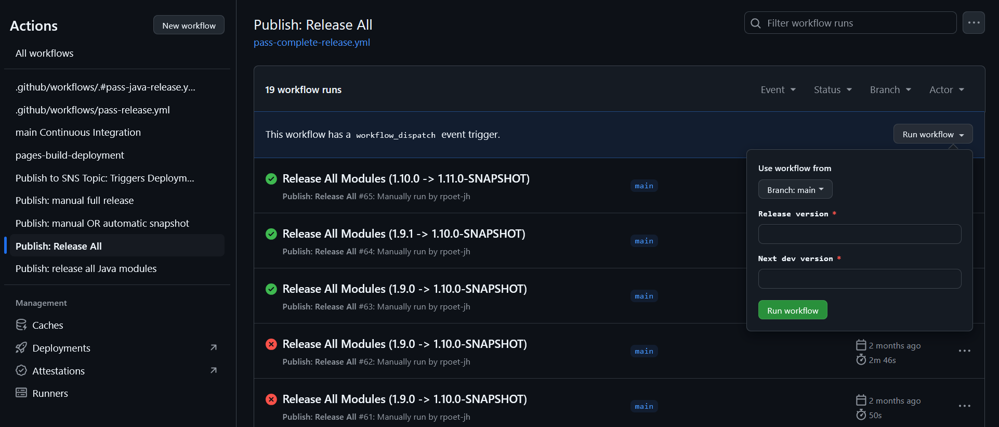

# PASS Release

This section outlines the overall process and steps to perform the community release of PASS.

A PASS release produces a set of Java artifacts, Docker images, and Documentation. Java artifacts are published on Sonatype Central Portal and Maven Central repositories. Docker images are pushed to [GitHub Container Registry (GHCR)](https://docs.github.com/en/packages/working-with-a-github-packages-registry/working-with-the-container-registry). Source code is tagged and release notes made available.

Each release of PASS has its own version which is used by every component. PASS uses `MAJOR.MINOR.PATCH` [semantic versioning](https://semver.org/) approach. The version should be chosen based on those guidelines.

## Release Steps

* Assign a Release Manager, the person who will be responsible for the release process. The Release Manager must be a [PASS committer](https://www.eclipse.org/projects/handbook/#roles-cm).
* Choose a release version that communicates the magnitude of the change.
* Create a GitHub issue in the main repository using the `Release Checklist Issue` template from the [main repository create new issue page](https://github.com/eclipse-pass/main/issues/new/choose).
* Follow the steps in the Release GitHub issue to complete the release.
  * See [these instructions](#triggering-the-release-all-github-workflow) for running the `Publish: Release All` GitHub Action workflow.

### Triggering the Release All GitHub workflow

* **Before running the `Publish: Release All` workflow, the [GitHub PAT configuration](#github-personal-access-token-setup) is required.**
* Navigate to [Publish: Release All](https://github.com/eclipse-pass/main/actions/workflows/pass-complete-release.yml)
* Click on the `Run workflow` dropdown button
* Confirm the branch is `main` and enter the versions in the `Release version` and `Next dev version` fields
    * Release version: full release version, e.g. 1.10.0. These versions should be regarded as immutable. These releases for Java projects cannot be updated or deleted.
    * Next dev version: snapshot or development versions, e.g. 1.11.0-SNAPSHOT (please use all capital letters for the SNAPSHOT suffix). These development versions are intended to be overwritten.
* Click the `Run workflow` button
* After a few seconds, a new workflow run should appear in the table with a yellow (in-progress) status dot. Clicking on that will allow you to monitor the run's progress by watching logs.

It is recommended that you monitor the automation after triggering it to make sure it completes successfully.

<figure><figcaption><p>Running Release All Workflow</p></figcaption></figure>

### GitHub Personal Access Token Setup

The `Publish: Release All` GitHub workflows depend on the `JAVA_RELEASE_PAT` secret having permission to access all the eclipse-pass repositories and write packages.
You have to create a new classic Personal Access Token (PAT) to do the release (GitHub/Settings/Developer Settings/Personal access tokens/Tokens (classic)).
If you do so, set the expiration to 7 days, check the `repo` and the `write:packages` scope (subscopes under `repo`
and `write:packages` will be selected too).

How to set the secret in the main repository using the gh command line tool [GitHub CLI](https://cli.github.com/):
```
gh auth login
gh secret set JAVA_RELEASE_PAT --body <PAT_VALUE> --repo eclipse-pass/main
```

## Alternate Release Procedures

The [Publish: Release All](https://github.com/eclipse-pass/main/actions/workflows/pass-complete-release.yml) GitHub Action workflow is the preferred way to complete the PASS release. 
However, it is possible to execute a PASS release with project automations one at a time or manually if needed. This is not recommended unless absolutely necessary since executing the
release manually introduces the chance of making mistakes.

* [Release Projects One At a Time](release-steps-project-one-at-a-time.md)
* [Manual Release](release-steps-manual.md)
