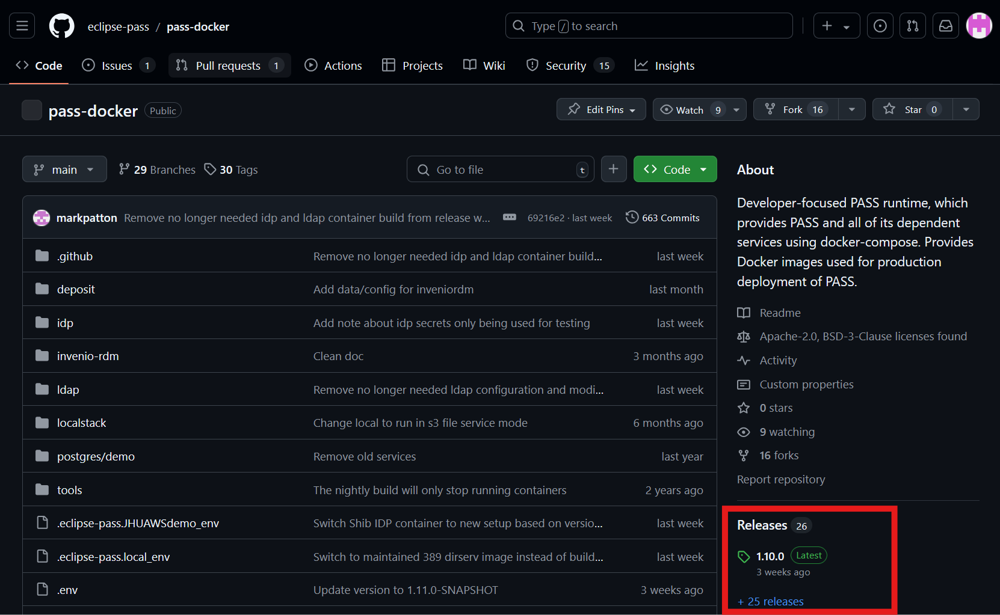

# Release Projects One At a Time

This section provides the details of performing a release one project at a time with automations by the release manager.

**[Publish: Release All](https://github.com/eclipse-pass/main/actions/workflows/pass-complete-release.yml) GitHub Action workflow is the preferred way to release PASS. Releasing PASS one project at a time should only be done if absolutely required.**

### Java projects

The individual Java projects can be released individually. Release these in the order defined here due to 
dependencies. Between each of these releases, you will need to wait for the Java artifacts to appear on Maven Central. 
This will give you enough time to do other release activities, such as releasing non-Java artifacts. The release 
workflows should wait for you, but checking will mitigate any potential issues with the release.

1. [main](https://github.com/eclipse-pass/main)
   * [Release workflow](https://github.com/eclipse-pass/main/actions/workflows/release.yml)
   * [Maven central](https://central.sonatype.com/artifact/org.eclipse.pass/eclipse-pass-parent)
2. [pass-core](https://github.com/eclipse-pass/pass-core)
   * [Release workflow](https://github.com/eclipse-pass/pass-core/actions/workflows/release.yml)
   * [Maven Central](https://central.sonatype.com/artifact/org.eclipse.pass/pass-core-main)
   * [Package](https://github.com/eclipse-pass/pass-core/pkgs/container/pass-core-main)
3. [pass-support](https://github.com/eclipse-pass/pass-support)
   * [Release workflow](https://github.com/eclipse-pass/pass-support/actions/workflows/release.yml)
   * [Maven Central](https://central.sonatype.com/artifact/org.eclipse.pass/pass-support)
   * [Notification Service](https://github.com/eclipse-pass/pass-support/pkgs/container/pass-notification-service)
   * [Grant Loader](https://github.com/orgs/eclipse-pass/packages/container/package/jhu-grant-loader)
   * [Deposit Services](https://github.com/orgs/eclipse-pass/packages/container/package/deposit-services-core)
   * [Journal Loader](https://github.com/orgs/eclipse-pass/packages/container/package/pass-journal-loader)
   * [NIHMS Loader](https://github.com/orgs/eclipse-pass/packages/container/package/pass-nihms-loader)

### Non-Java projects

These can be released in any order. You should release these between releasing Java projects, while waiting for artifacts to become available in Maven Central.

* [pass-ui](https://github.com/eclipse-pass/pass-ui)
  * [Release workflow](https://github.com/eclipse-pass/pass-ui/actions/workflows/release.yml)
  * [Package](https://github.com/eclipse-pass/pass-ui/pkgs/container/pass-ui)
* [pass-acceptance-testing](https://github.com/eclipse-pass/pass-acceptance-testing)
  * [Release workflow](https://github.com/eclipse-pass/pass-acceptance-testing/actions/workflows/release.yml)

### Other projects

This must be released last because it relies on some of the Docker images that will be published during the release process of the preceding projects.

1. [pass-docker](https://github.com/eclipse-pass/pass-docker)
   * [Release workflow](https://github.com/eclipse-pass/pass-docker/actions/workflows/release.yml)

### GitHub code release

You will have to manually create a GitHub release through the GitHub web interface to complete the release of each of these components. This can generally be done any time after the release automation completes successfully, since the release will be made against a tag created by the automation.

<figure><figcaption>
Code Release Section of the Repository
</figcaption></figure>

* Navigate to the Releases section of the repository.
* Click the "Draft new release" button near the top of the page.
* Input release title, matching the release version used for the release (e.g. 0.5.0).
* Choose the release tag that was created during the automation.
* Click on the "Generate release notes" button to generate a list of changes since the last release.

## Triggering a GitHub workflow

Take [eclipse-pass/main](https://github.com/eclipse-pass/main) as an example.

* Navigate to the `Actions` tab in your target repository. Select the workflow you want to trigger, e.g. the Release workflow in [Publish: manual full release](https://github.com/eclipse-pass/main/actions/workflows/release.yml)
* Click on the `Run workflow` button
* Input the branch you wish to run the release against and the desired `Release` and `Next dev` versions
  * Release version: full release version, e.g. 1.10.0. These versions should be regarded as immutable. These releases for Java projects cannot be updated or deleted.
  * Next dev version: snapshot or development versions, e.g. 1.11.0-SNAPSHOT (please use all capital letters for the SNAPSHOT suffix). These development versions are intended to be overwritten.
* After a few seconds, a new workflow run should appear in the table with a yellow (in-progress) status dot. Clicking on that will allow you to monitor the run's progress by watching logs.

It is recommended that you monitor the automation after triggering it to make sure it completes successfully before moving on to release the next project.
